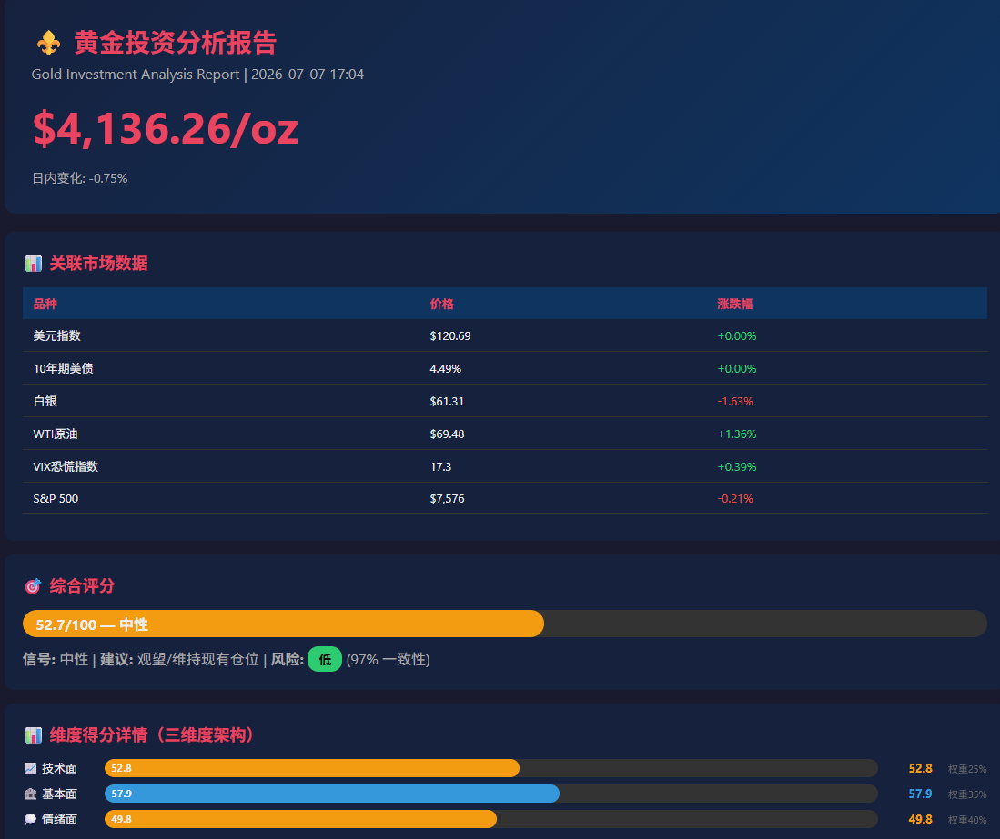

<div align="center">

# ⚜️ 黄金投资分析助手

**Gold Investment Assistant** — 基于实时数据的多维度黄金投资分析工具

[](LICENSE)
[](https://www.python.org/downloads/)
[](requirements.txt)
[](#-快速开始)
[](#-贡献指南)
[](#-致谢)

综合 **技术面 · 基本面 · 情绪面** 三维度，通过量化评分系统输出明确的交易信号和操作建议。

[功能特性](#-功能特性) · [快速开始](#-快速开始) · [分析框架](#-分析框架) · [配置](#%EF%B8%8F-自定义配置) · [FAQ](#-常见问题faq) · [贡献](#-贡献指南)

</div>

---

## 📖 目录

- [✨ 功能特性](#-功能特性)
- [📁 项目结构](#-项目结构)
- [🚀 快速开始](#-快速开始)
- [📊 分析框架](#-分析框架)
- [🔧 基本面分析详解](#-基本面分析详解)
- [📡 数据源架构](#-数据源架构)
- [🛠️ 自定义配置](#%EF%B8%8F-自定义配置)
- [📋 技术指标详解](#-技术指标详解)
- [📄 输出示例](#-输出示例)
- [🧪 回测框架](#-回测框架)
- [🧫 测试](#-测试)
- [❓ 常见问题（FAQ）](#-常见问题faq)
- [🛣️ 路线图](#%EF%B8%8F-路线图)
- [🤝 贡献指南](#-贡献指南)
- [⚠️ 免责声明](#%EF%B8%8F-免责声明)
- [📄 许可证](#-许可证)
- [🙏 致谢](#-致谢)
- [⭐ Star History](#-star-history)

---

## ✨ 功能特性

- 📈 **技术分析引擎**：RSI、MACD、布林带、均线系统、支撑阻力位、趋势判断、动量分析、背离检测、OBV能量潮
- 🏦 **基本面分析**：Fed 政策（新闻情绪 + 实际收益率）、美元指数、通胀数据、收益率曲线、结构性因素（央行购金、财政赤字、去美元化）
- 💭 **情绪面分析**：VIX恐慌指数、油价传导、金银比、多源新闻实时抓取与情绪打分
- 🎯 **三维度综合评分**：加权评分（0-100），输出明确交易信号
- 💡 **智能投资建议**：操作方向、仓位管理、风控方案、关键关注点
- 📊 **HTML可视化报告**：暗色主题网页报告，含 Plotly 交互式价格/RSI 图表
- 🔄 **多源混合数据**：FRED API + 东方财富 + 新浪财经 + 腾讯财经，自动降级兜底
- 📉 **回测框架**：历史数据验证评分体系有效性
- 🪶 **零强制依赖**：核心逻辑使用 Python 标准库实现，开箱即用

---

## 📁 项目结构

```
gold_assistant/
├── gold_assistant.py       # 主程序入口
├── config.py               # 统一配置文件（权重、参数、词典、数据源）
├── hybrid_data_fetcher.py  # 混合数据获取器（FRED / 新浪 / 东财 / 腾讯）
├── fundamental.py          # 基本面分析引擎
├── technical.py            # 技术分析引擎
├── sentiment.py            # 情绪面分析引擎
├── scoring.py              # 综合评分与建议引擎
├── report.py               # HTML 报告生成器（Plotly 图表通过 CDN 加载）
├── backtest.py             # 回测框架
├── utils.py                # 工具函数（HTTP 请求、日志、缓存）
├── tests/
│   └── test_core.py        # 单元测试
├── docs/
│   └── screenshots/        # README 用的报告截图
├── reports/                # HTML 报告输出目录（运行时自动生成，初始为空）
├── requirements.txt        # 依赖列表（仅 python-dotenv 可选）
├── .env.example            # 环境变量模板
├── .gitignore
├── LICENSE                 # MIT 许可证
└── README.md
```

---

## 🚀 快速开始

### 环境要求

- **Python 3.8+**
- **零强制外部依赖**（核心逻辑使用标准库实现）
- FRED API Key（可选，免费申请：https://fred.stlouisfed.org/docs/api/api_key.html）
  - 不设置则自动降级到东方财富 + 新浪财经数据源

### 1. 克隆仓库

```bash
git clone https://github.com/houguofei/gold_assistant.git
cd gold_assistant
```

### 2. 创建虚拟环境（推荐）

**Linux / macOS:**
```bash
python3 -m venv venv
source venv/bin/activate
```

**Windows (PowerShell):**
```powershell
python -m venv venv
.\venv\Scripts\Activate.ps1
```

### 3. 安装依赖

```bash
# 核心逻辑使用 Python 标准库实现，无需安装任何包即可运行
# 可选：安装 python-dotenv 自动加载 .env 中的 FRED_API_KEY
pip install -r requirements.txt
```

> 📌 HTML 报告中的 Plotly 图表通过 CDN 加载（`cdn.plot.ly`），本地无需安装 Plotly 包。打开 HTML 报告时需联网。

### 4. 配置环境变量（可选）

```bash
cp .env.example .env
# 编辑 .env 填入你的 FRED_API_KEY
```

或通过环境变量直接设置：

**Linux / macOS:**
```bash
export FRED_API_KEY="your-key-here"
```

**Windows (PowerShell):**
```powershell
$env:FRED_API_KEY = "your-key-here"
```

### 5. 运行

```bash
# 标准运行（终端报告 + HTML报告）
python gold_assistant.py --html

# 仅终端报告（默认行为，不加 --html 即可）
python gold_assistant.py

# 快速模式（仅关键指标）
python gold_assistant.py --quick

# 运行回测
python gold_assistant.py --backtest
```

> 💡 命令行参数可组合使用，如 `python gold_assistant.py --html --quick`。

运行 `--html` 后，可在 `reports/` 目录下找到生成的可视化报告。

---

## 📊 分析框架

### 三维度评分体系

| 维度 | 权重 | 核心指标 |
|------|------|----------|
| **技术面** | 25% | RSI、MACD、布林带、均线排列、支撑阻力、动量、背离、OBV |
| **基本面** | 35% | Fed政策、美元指数、通胀、实际收益率、收益率曲线、结构性因素 |
| **情绪面** | 40% | VIX恐慌指数、新闻情绪、油价波动、金银比 |

> 权重统一在 [`config.py`](config.py) 中配置，`scoring.py` 自动同步。

### 评分 → 信号映射

| 评分区间 | 信号 | 建议 |
|----------|------|------|
| 75-100 | 🟢 强烈看多 | 积极建仓/加仓，30-40%仓位 |
| 65-75 | 🟢 看多 | 分批建仓，20-30%仓位 |
| 55-65 | 🟡 偏多 | 小仓位试探，10-15%仓位 |
| 45-55 | ⚪ 中性 | 观望/维持现有仓位 |
| 35-45 | 🟡 偏空 | 减仓/止盈，减至10%以下 |
| 25-35 | 🔴 看空 | 大幅减仓，减至5%以下 |
| 0-25 | 🔴 强烈看空 | 清仓离场 |

---

## 🔧 基本面分析详解

### 1. Fed政策分析

[`fundamental.py`](fundamental.py) 的 `analyze_fed_policy()` 按以下优先级判断（前者可用时优先采用，否则降级到下一级）：

| 优先级 | 数据源 | 说明 |
|--------|--------|------|
| 1️⃣ | FedWatch 利率预期（已接入） | CME 联邦基金期货隐含的降息/加息概率，由 [`hybrid_data_fetcher.py`](hybrid_data_fetcher.py) 的 `_fetch_fedwatch_rates()` 实时抓取 |
| 2️⃣ | 新闻情绪 + 联邦基金利率 | 扫描多源新闻关键词量化鹰派/鸽派倾向（`fed_news_sentiment`，由数据获取器**自动计算**），辅以当前利率绝对值判断 |
| 3️⃣ | 实际收益率（始终附加） | `US10Y - CPI`，<1% 利多黄金，>2% 利空黄金（无论上面走哪条分支都会叠加） |

**鹰派/鸽派关键词打分**：

通过扫描新闻标题中的关键词进行加权评分（正数=鸽派利多，负数=鹰派利空）。完整词典见 [`config.py`](config.py) 的 `KEYWORD_SENTIMENT`（中文）与 `KEYWORD_SENTIMENT_EN`（英文），以下为示例：

| 类型 | 关键词（中文） | 关键词（英文） | 分值 |
|------|-------------|-------------|------|
| **鹰派** | 加息(-8)、加息预期(-7)、鹰派(-7)、紧缩(-6) | rate hike(-8)、hawkish(-7)、tightening(-6)、higher for longer(-7) | 负分 |
| **鸽派** | 降息(+8)、降息预期(+7)、鸽派(+7)、宽松(+6) | rate cut(+8)、dovish(+7)、easing(+6)、pivot(+6) | 正分 |
| **避险/地缘** | 避险需求(+5)、地缘政治(+4)、央行购金(+7)、战争(+5) | safe haven(+6)、geopolitical(+4)、central bank buy(+7)、war(+6) | 正分 |
| **衰退/危机** | 衰退(+5)、硬着陆(+5)、银行危机(+6)、滞胀(+7) | recession(+5)、hard landing(+5)、banking crisis(+6)、stagflation(+7) | 正分 |

**单条新闻限幅**：单条新闻的影响被限制在 `-10 ~ +10` 范围内（`max(-10, min(10, total_score))`），防止单条极端新闻主导整体评分。

**新闻情绪 → 鸽派/鹰派判断阈值**（`fundamental.py::_fed_policy_from_news`）：

| `fed_news_sentiment` | 判断 | 对黄金影响 | 评分调整 |
|---|---|---|---|
| `< -5` | 强烈鹰派 | 利空 | -15 |
| `-5 ~ -2` | 偏鹰派 | 利空 | -10 |
| `-2 ~ +2` | 中性 | 中性 | 0 |
| `+2 ~ +5` | 偏鸽派 | 利多 | +10 |
| `> +5` | 强烈鸽派 | 利多 | +15 |

> 📌 `fed_news_sentiment` 由数据获取器自动计算（扫描 Fed 相关新闻源的关键词），无需手动设置。如需手动覆盖，可在 `gold_assistant.py` 的 `USER_MACRO_OVERRIDES` 中设置，或扩展 `hybrid_data_fetcher.py` 接入更多实时新闻源。

### 2. 美元指数分析

- 数据源：FRED `DTWEXBGS`（Broad 贸易加权美元指数，刻度约 120；非传统 ICE DXY 的 ~100）
- **水平阈值**：>125 强烈利空（-20），>119 偏空（-10），<113 利多（+15）
- **3 个月趋势**：涨幅 >5% 强烈压制（-15），>2% 压制（-8），跌幅 >3% 利好（+12）
- **1 年趋势**：涨幅 >5% 利空（-8），跌幅 >5% 利多（+8）

> ⚠️ 注意：`DTWEXBGS` 是贸易加权广义美元指数，数值范围与传统 DXY 不同。代码中的阈值已针对此刻度校准。

### 3. 通胀分析

- 数据源：FRED `CPIAUCSL`（CPI 指数）、`CPILFESL`（核心 CPI 指数）；备用：东方财富 CPI 年率接口
- 同比自动计算：`(当前值 - 12个月前) / 12个月前 * 100`
- 趋势推导：比较近 3 个月均值与之前 3 个月均值（`rising` / `cooling` / `stable`）
- **CPI 同比阈值**：>5% 强利好（+15），>3% 温和支撑（+8），<2% 削弱需求（-8）
- **核心 CPI 阈值**：>4% 支撑通胀溢价（+8），<2% 轻微利空（-5）
- **通胀趋势**：`rising` +10，`cooling` -5，`stable` 0

### 4. 收益率曲线

- 数据源：FRED `DGS10` / `DGS2`；备用：东方财富国债收益率接口
- **2s10s 利差阈值**：
  - `< -0.5%` 深度倒挂 → 强烈利多（+15，衰退预期强）
  - `-0.5% ~ -0.1%` 倒挂 → 支撑黄金（+8）
  - `-0.1% ~ 0.3%` 平缓 → 中性（+2）
  - `> 0.3%` 陡峭 → 轻微利空（-3，经济预期较好）

### 5. 结构性因素

长期结构性因素在 [`fundamental.py`](fundamental.py) 的 `analyze_structural()` 中量化，权重占基本面 30%（最高）。

| 因素 | 阈值 | 评分调整 |
|------|------|----------|
| **美国财政赤字 / GDP** | >6% | +18 |
| | >4% | +10 |
| | <3% | -5 |
| **美国债务 / GDP** | >130% | +12 |
| | >100% | +6 |
| **央行计划增持黄金比例** | >40% | +10 |
| | >25% | +5 |
| **央行购金趋势** | `rising` | +5 |
| **去美元化动能** | >0.7 | +8 |
| | >0.4 | +3 |

> 📌 数据来源：默认值参考世界黄金协会 2024 报告，可在 [`config.py`](config.py) 的 `MACRO_PARAMS` 中更新。地缘政治风险不在此维度直接打分，而是通过新闻情绪关键词（"地缘政治"、"战争"、"中东"、"制裁"等）在情绪面维度间接体现。

---

## 📡 数据源架构

### 宏观数据获取优先级

```
东方财富 datacenter → FRED API（需 Key）→ 新浪财经 → 腾讯美股 ETF 代理（UUP→DXY、TLT→美债收益率）→ 默认值兜底
```

> 📌 黄金实时价格链路以**新浪财经**优先（见下节），而宏观数据链路以**东方财富**优先、FRED 作为精确补充（需 `FRED_API_KEY`）。缺失 FRED Key 时自动降级，不影响运行。

| 数据项 | 首选源 | 备用源 | 说明 |
|--------|--------|--------|------|
| 美联储利率 | 东方财富 datacenter | FRED FEDFUNDS | 当前政策利率 |
| CPI年率 | 东方财富 datacenter | FRED CPIAUCSL | 自动计算同比 |
| US10Y / US2Y | 东方财富债券接口 | 腾讯 TLT 代理 / FRED DGS10·DGS2 | 实时收益率 |
| DXY | 东方财富全球指数 | 腾讯 UUP 代理 / FRED DTWEXBGS | 东方财富/UUP 代理刻度 ~100，FRED DTWEXBGS 刻度 ~120 |
| 核心CPI | FRED `CPILFESL` | — | 取历史数据计算同比 |
| 通胀趋势 | FRED `CPIAUCSL` | — | 近 3 个月均值 vs 之前 3 个月均值 |

### 新闻数据源

新闻源在 [`config.py`](config.py) 的 `NEWS_SOURCES` 中配置，由 [`sentiment.py`](sentiment.py) 的 `fetch_news_from_rss()` 抓取：

| 来源 | 类型 | 内容 |
|------|------|------|
| 新浪财经-美股 | sina_api | 全球金融市场要闻 |
| 新浪7x24快讯 | html_parse | 实时市场动态 |
| 新浪财经-黄金相关 | sina_api | 贵金属 / 黄金市场（关键词过滤） |
| 新浪财经-美联储 | sina_api | 货币政策 / 央行动态（关键词过滤） |
| Reuters | rss | 国际财经新闻 |

### 实时价格与历史 K 线

黄金价格采用多级兜底链（[`hybrid_data_fetcher.py`](hybrid_data_fetcher.py) 的 `fetch_gold_data()`）：

```
实时价：   新浪财经现货 hf_XAU (XAU/USD) → 东方财富期货 hf_GC → 腾讯财经期货 hf_GC → 手动输入价格 → 参考价 $4,000 兜底
历史K线：  新浪 COMEX 期货 hf_GC（完整历史）→ 新浪沪金 AU0（CNY/克，自动缩放）→ 东方财富 113.aum → 基于真实当前价生成模拟历史
```

> ⚠️ 当所有真实 K 线源都不可用时，程序会基于**当前真实价格**生成一段模拟历史数据（仅用于技术指标计算），并在日志与报告中明确标注 `data_quality=simulated`，此时技术指标仅供参考。

| 品种 | 实时价数据源 | 说明 |
|------|--------|-----|
| 黄金（现货/期货） | 新浪 `hf_XAU` / 东方财富 `hf_GC` / 腾讯 `hf_GC` | 多源兜底 |
| 白银 / 原油 / VIX / 标普 | 新浪财经期货（`hf_SI` / `hf_CL` / `hf_VX` / `hf_ES`） | `hq.sinajs.cn` |
| 美元指数 / 美债（兜底） | 东方财富全球指数 / 腾讯美股 ETF（`UUP` / `TLT`）代理 | `qt.gtimg.cn` |

---

## 🛠️ 自定义配置

所有配置集中在 [`config.py`](config.py)，避免分散维护。

### 更新宏观参数

编辑 `config.py` 中的 `MACRO_PARAMS`（以下为 fallback 默认值，运行时会被实时数据自动覆盖）：

```python
MACRO_PARAMS = {
    "fed_rate_upper": 3.75,            # 联邦基金利率上限（%）
    "dxy_current": 120.89,             # 美元指数（DTWEXBGS 刻度，~120）
    "cpi_yoy": 4.2,                    # CPI 同比（%）
    "core_cpi_yoy": 2.82,              # 核心 CPI 同比（%）
    "us10y_yield": 4.38,               # 10 年期美债收益率（%）
    "us2y_yield": 4.10,                # 2 年期美债收益率（%）
    "us10y_real": 0.18,                # 实际收益率（%）
    "yield_curve_2s10s": 0.28,         # 2s10s 利差（%）
    "inflation_trend": "rising",       # 通胀趋势: rising / cooling / stable
    "fed_policy_tone": "neutral",      # Fed 政策基调: hawkish / dovish / neutral
    "us_fiscal_deficit_gdp": 6.0,      # 财政赤字 / GDP（%）
    "us_debt_gdp": 125.0,              # 债务 / GDP（%）
    "cb_buying_pct_plan_increase": 45, # 计划增持黄金的央行比例（%）
    "dedollarization_momentum": 0.7,   # 去美元化动能（0-1）
}
```

> 💡 程序会自动从 FRED / 东方财富获取最新数据覆盖默认值。如需强制使用自定义值，在 `gold_assistant.py` 的 `USER_MACRO_OVERRIDES` 中设置。

### 调整评分权重

编辑 `config.py` 中的 `SCORING["weights"]`：

```python
SCORING = {
    "weights": {
        "technical":   25,   # 技术面
        "fundamental": 35,   # 基本面
        "sentiment":   40,   # 情绪面
    },
}
```

> 📌 权重之和无需等于 100，`scoring.py` 会自动归一化。运行时还会根据技术面判断的市场状态（牛市 / 熊市 / 震荡市）动态调整权重，详见 `ScoringEngine._adjust_weights_by_regime()`。

### 调整新闻情绪词典

编辑 `config.py` 中的 `KEYWORD_SENTIMENT`（中文）和 `KEYWORD_SENTIMENT_EN`（英文）：

```python
KEYWORD_SENTIMENT = {
    "加息": -8, "降息": +8, "鹰派": -7, "鸽派": +7,
    "央行购金": +7, "地缘政治": +4, "衰退": +5,
    # ... 更多关键词
}
```

---

## 📋 技术指标详解

| 指标 | 说明 | 买入信号 | 卖出信号 |
|------|------|----------|----------|
| RSI(14) | 相对强弱指标 | <30 超卖 | >70 超买 |
| MACD | 趋势动量指标 | 金叉 / 柱状图由负转正 | 死叉 / 柱状图由正转负 |
| 布林带 | 波动率通道 | 触及下轨 | 触及上轨 |
| MA均线 | 趋势方向 | 短期>长期（多头排列） | 短期<长期（空头排列） |
| ATR | 波动率（仅展示，不参与评分） | 高波动=机会多 | 高波动=风险大 |
| OBV | 能量潮 | 价格涨+成交量增 | 价格跌+成交量增（背离） |
| 背离 | 价格与指标背离 | 底背离 | 顶背离 |

---

## 📄 输出示例

### 终端输出

> 实际终端输出包含 **关联市场快照、各维度评分的详细计算过程（因子级）、综合评分公式与权重、投资建议、风控方案、关键关注点与风险等级**。以下为节选示意：

```
======================================================================
  ⚜️  黄金投资分析助手  |  Gold Investment Assistant
  📅 2026-07-01 18:00:00
======================================================================

  💰 黄金现货价格 (XAU/USD):  $3,350.00/盎司
  📊 日内变化:      +15.20 (+0.46%)

  📈 技术面分析
  市场状态: 震荡市 (置信度60%) (60日涨跌: +1.20%)
  评分维度: RSI(20%) + MACD(15%) + 布林带(10%) + 均线趋势(20%) + 背离(15%) + 动量(10%) + 量能(10%)
    RSI(14): 54.3 → 中性
    MACD: 2.15 / 1.98 → 金叉
    ...
    最终得分: 58.2/100  ████████████████████░░░░░░░░░░

  🏦 基本面分析
  评分维度: Fed政策(25%) + 美元(20%) + 通胀(15%) + 收益率曲线(10%) + 结构性(30%)
    🏛️ Fed政策: 得分+12 × 权重25% = +3.0 → 利多
    ...
    最终得分: 52.4/100  █████████████████░░░░░░░░░░░░░

  💭 情绪面分析
  ...

  🎯 综合分析结论
  综合评分权重: 技术×25% + 基本面×35% + 情绪×40%
  最终得分: 55.1/100  ████████████████████░░░░░░░░░░
  综合信号: 🟡 偏多
  操作建议: 小仓位试探
  仓位建议: 10-15%
  💡 风控建议: 止损 3-5% | 止盈 10-15% | 回撤容忍 5-8%
  ⚠️ 关键关注点: 技术面偏多：关注能否突破上方阻力、RSI是否超买
```

> 💡 完整示例请本地执行 `python gold_assistant.py --html`，终端与 `reports/` 目录下的 HTML 报告会展示全部分析细节。
### HTML报告

运行 `python gold_assistant.py --html` 后，在 `reports/` 目录下生成暗色主题的可视化报告，包含：

- 实时价格和市场快照
- **Plotly 交互式价格走势图**（含 MA20 / MA50）
- **Plotly 交互式 RSI 图**（含超买 / 超卖线）
- 三维度评分卡片
- 各维度详细分析
- 投资建议和风控方案
- 关键关注点列表

### 报告截图



> 📸 欢迎在 PR 中补充更多场景的截图到 `docs/screenshots/` 目录。

---

## 🧪 回测框架

[`backtest.py`](backtest.py) 提供历史数据回测功能：

- 在历史数据上逐日模拟评分
- 统计综合评分与未来 N 日收益率的相关性（Pearson）
- 分析各评分区间的平均收益、胜率
- 评估多空策略（看多 ≥65 / 看空 ≤35）表现

> ⚠️ **回测限制**：默认 `technical_only=True`，即仅**技术面**信号参与回测（基于真实 K 线，结果可靠）；基本面/情绪面使用静态/中性值，**仅供示意**。若所有历史 K 线源均不可用，会退化为**模拟数据**回测（仅演示逻辑，非真实结论）。

```bash
python gold_assistant.py --backtest
# 或
python backtest.py
```

回测结果保存为 `backtest_result.json`（已被 `.gitignore` 忽略）。

---

## 🧫 测试

使用 pytest 运行单元测试：

```bash
# 安装 pytest（如尚未安装）
pip install pytest

# 运行测试
pytest tests/ -v
```

也可直接运行测试文件：

```bash
python tests/test_core.py
```

测试覆盖以下模块（详见 [`tests/test_core.py`](tests/test_core.py)）：

- **技术分析**：SMA、EMA、RSI、MACD、布林带
- **评分引擎**：三维度加权评分、极端分数、权重归一化
- **配置校验**：`TECH_SCORE_WEIGHTS` 结构完整性
- **工具函数**：`safe_float`、`safe_int`、`clamp`

---

## ❓ 常见问题（FAQ）

<details>
<summary><b>没有 FRED API Key 能用吗？</b></summary>

可以。黄金实时价格与历史 K 线来自新浪/东方财富/腾讯，无需 FRED Key；宏观数据（美债收益率、CPI、DXY 历史等）会优先从东方财富、新浪、腾讯代理获取，FRED Key 仅作为更精确的补充。缺失 Key 时程序自动降级，核心功能完全可用。

</details>

<details>
<summary><b>Windows 终端 emoji / 中文显示乱码？</b></summary>

程序已自动将 stdout 设置为 UTF-8 编码。如仍有问题，请执行：
- PowerShell：`chcp 65001`
- CMD：`chcp 65001`
- 或使用 Windows Terminal 等现代终端。

</details>

<details>
<summary><b>数据源请求失败 / 限流？</b></summary>

- 程序内置多源兜底机制，单一数据源失败不影响整体运行
- 新浪财经接口有时会对频繁请求限流，间隔几分钟再试
- FRED API 免费版限速 120 次/分钟，正常使用不会触发

</details>

<details>
<summary><b>需要安装哪些依赖？</b></summary>

**零强制依赖**。核心逻辑（HTTP 请求、技术指标计算、报告生成）全部使用 Python 标准库实现。`requirements.txt` 中唯一的可选依赖是 `python-dotenv`，用于自动加载 `.env` 文件中的 `FRED_API_KEY`。HTML 报告里的 Plotly 图表通过 CDN 加载，本地无需安装。

</details>

<details>
<summary><b>如何调整评分权重？</b></summary>

编辑 [`config.py`](config.py) 中的 `SCORING["weights"]` 字典，三个维度权重之和无需等于 100，程序会自动归一化。

</details>

<details>
<summary><b>支持其他品种（白银/原油）吗？</b></summary>

当前主分析对象为黄金。`hybrid_data_fetcher.py` 已实现白银、原油、VIX 等数据获取，可作为情绪面辅助指标。如需独立分析其他品种，可参考 `gold_assistant.py` 的主流程做扩展。

</details>

---

## 🛣️ 路线图

- [ ] 接入更多新闻源（Bloomberg / WSJ / 金十数据）
- [ ] 增加机器学习模型辅助评分
- [ ] 支持自定义品种（白银 / 原油 / 比特币）
- [ ] 增加 Web UI 可视化界面
- [ ] 增加 CI/CD 自动化测试与发布
- [ ] 提供 Docker 一键部署镜像
- [ ] 增加多语言报告输出（中 / 英）

> 欢迎在 [Issues](../../issues) 中提出建议或投票优先级。

---

## 🤝 贡献指南

欢迎通过 Issue 和 Pull Request 参与贡献！

### 贡献流程

1. **Fork** 本仓库
2. 创建特性分支：`git checkout -b feature/AmazingFeature`
3. 提交更改：`git commit -m 'Add some AmazingFeature'`
4. 推送分支：`git push origin feature/AmazingFeature`
5. 提交 **Pull Request**

### 贡献方向

- 🐛 报告或修复 Bug（[提交 Issue](../../issues/new?labels=bug&template=bug_report.md)）
- 💡 提出新功能建议（[提交 Issue](../../issues/new?labels=enhancement&template=feature_request.md)）
- 📝 改进文档和示例
- 🌍 翻译 README 到其他语言
- 🧪 补充测试用例
- 🔌 接入新的数据源

### 代码规范

- 保持 Python 代码风格一致（PEP 8）
- 新功能需附测试用例（位于 `tests/`）
- 修改配置项需同步更新 README
- Commit message 使用中英文均可，语义清晰即可

---

## ⚠️ 免责声明

- 本工具仅供**学习和研究**目的使用，**不构成任何投资建议**
- 黄金市场波动剧烈，过去表现不代表未来收益
- 请根据自身风险承受能力谨慎决策
- 所有数据和分析可能存在延迟或误差
- 使用本工具造成的任何直接或间接损失，作者不承担任何责任

---

## 📄 许可证

本项目基于 [MIT License](LICENSE) 开源。

你可以自由地使用、修改、分发本项目的代码，但请保留原始许可证声明。

---

## 🙏 致谢

本项目的数据来源包括：

- [FRED (Federal Reserve Economic Data)](https://fred.stlouisfed.org/) — 美联储经济数据
- [东方财富数据中心](https://data.eastmoney.com/) — 宏观经济数据
- [新浪财经](https://finance.sina.com.cn/) — 实时行情与新闻
- [腾讯财经](https://gu.qq.com/) — 美股 ETF 行情代理
- [Plotly](https://plotly.com/) — 交互式可视化（通过 CDN 引用）

感谢以上数据源为开源社区提供的服务。

---

## ⭐ Star History

<a href="https://star-history.com/#houguofei/gold_assistant&Date">
 <picture>
   <source media="(prefers-color-scheme: dark)" srcset="https://api.star-history.com/svg?repos=houguofei/gold_assistant&type=Date&theme=dark" />
   <source media="(prefers-color-scheme: light)" srcset="https://api.star-history.com/svg?repos=houguofei/gold_assistant&type=Date" />
   
 </picture>
</a>

---

<div align="center">

**如果这个项目对你有帮助，欢迎 ⭐ Star 支持！**

Made with ❤️ for gold investors

</div>
